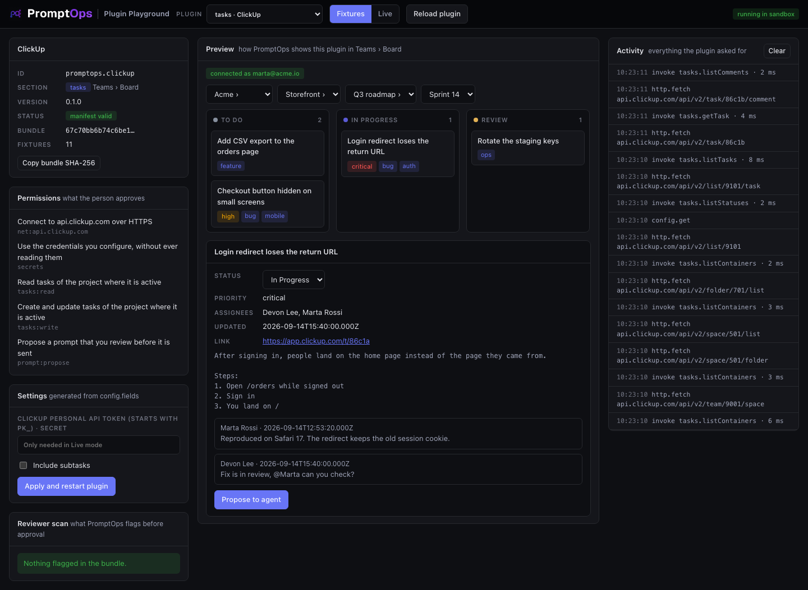

<a href="https://promptops.it"></a>

# ClickUp for PromptOps

Brings the tasks of your ClickUp lists into the **Teams › Board** of [PromptOps](https://promptops.it) and keeps their status in sync.



| | |
|---|---|
| Plugin id | `promptops.clickup` |
| Section | `tasks` |
| Status | Version 0.1.0. Runs in the plugin sandbox. The board does not read from plugins yet: see [MIGRATION.md](MIGRATION.md) |

## What it does

- Lets you pick a list by walking your ClickUp tree: Workspace, Space, Folder, List.
- Builds the board columns from the statuses of that list, in ClickUp order and with their colors.
- Shows each task with title, description, priority, tags, assignees and comments.
- Moves a task to another status when you move the card.
- Proposes a prompt about a task for you to review. It never writes to an agent on its own.

## What it can do

People approve these permissions before installing. A plugin can never read prompts, agent answers, files or the terminal.

| Permission | Meaning |
|---|---|
| `net:api.clickup.com` | Connect to api.clickup.com over HTTPS. No other host |
| `secrets` | Use your ClickUp token without ever reading it |
| `tasks:read` | Read tasks of the project where it is active |
| `tasks:write` | Update tasks of the project where it is active |
| `prompt:propose` | Propose a prompt that you review before it is sent |

## Set it up

1. In ClickUp open **Settings › Apps** and copy your personal API token. It starts with `pk_`.
2. In PromptOps open **Plugins › Installed › ClickUp › Configure** and paste it.

The token stays on your device. The plugin writes `{{secret:token}}` and PromptOps fills it in when a request leaves, only towards `api.clickup.com`.

| Setting | Default | Meaning |
|---|---|---|
| ClickUp personal API token | none | Required |
| Include subtasks | off | Show subtasks as cards too |

## Develop

This folder contains only the plugin. You test it with the PromptOps templates repository, which holds the playground.

```bash
git clone https://github.com/shellonback/promptops-plugin-templates.git
node promptops-plugin-templates/playground/server.mjs --plugin .
```

Open http://127.0.0.1:4173 and choose **tasks · ClickUp**. It starts in **Fixtures** mode with the sample workspace in `fixtures.json`, so it works offline. To test against your real ClickUp, type your token in the Settings card, press **Apply and restart plugin** and switch to **Live**.

| File | What it is |
|---|---|
| `promptops-plugin.json` | The manifest: id, section, host, permissions, settings |
| `dist/plugin.js` | The plugin. One file, no dependencies, no build step |
| `fixtures.json` | A sample ClickUp workspace for offline testing. Not used by PromptOps |
| `test/plugin.test.mjs` | Tests that run the plugin outside PromptOps with a fake SDK |

```bash
node --test                                                 # 10 tests, no dependencies
node promptops-plugin-templates/tools/validate.mjs .        # the same checks PromptOps runs
```

## How it talks to ClickUp

| The board asks | The plugin calls |
|---|---|
| Who am I connected as | `GET /user` |
| Workspaces | `GET /team` |
| Spaces of a workspace | `GET /team/{id}/space?archived=false` |
| Folders and folderless lists of a space | `GET /space/{id}/folder` and `GET /space/{id}/list`, in parallel |
| Lists of a folder | `GET /folder/{id}/list?archived=false` |
| Columns | `GET /list/{id}`, statuses sorted by `orderindex` |
| Tasks, one page | `GET /list/{id}/task?page=&include_closed=true&subtasks=&date_updated_gt=&statuses[]=` |
| One task | `GET /task/{id}` |
| Move a card | `PUT /task/{id}` with the new status |
| Comments | `GET /task/{id}/comment` |

It retries twice on `429` and `5xx`, waiting for `retry-after` when ClickUp sends it. It never retries a real `4xx`. Ids are checked before they go into a URL.

## Release

1. Raise `version` in `promptops-plugin.json`, commit and push. The repository must be public.
2. Run `validate.mjs`. It prints the version, the commit SHA and the bundle SHA-256.
3. In PromptOps open **Plugins › My plugins**, press **Submit for review** and paste those values with the manifest.

The current version stays live until the new one is approved.

## License

The code is MIT. See [LICENSE](LICENSE). The PromptOps and ClickUp names and logos belong to their owners.
